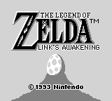
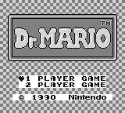
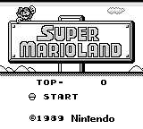
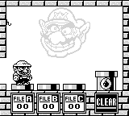
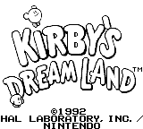
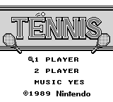
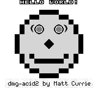

# jgbc: GameBoy (Color) Emulator

A fast and semi-accurate GameBoy (Color) emulator for Windows and Linux.
Written in C/C++ with SDL2.

## Screenshots

## Project Status

### Working

- Loading roms (parsing header, etc...)
- All CPU instructions implemented correctly
- Background / Window graphics
- Sprites
- Interrupts
- Timers
- Joypad
- MBC 1, 5
- Sound
- Save games

### Not Working

- Some GameBoy Color specific features (in progress)
- Other MBCs

## Tests

### CPU instructions

| Name          | Status | Output |
| ------------- |:------:|:------:|
| 01-special | :heavy_check_mark: | Passed |
| 02-interrupts | :heavy_check_mark: | Passed |
| 03-op sp,hl | :heavy_check_mark: | Passed |
| 04-op r,imm | :heavy_check_mark: | Passed |
| 05-op rp | :heavy_check_mark: | Passed |
| 06-ld r,r | :heavy_check_mark: | Passed |
| 07-jr,jp,call,ret,rst | :heavy_check_mark: | Passed |
| 08-misc instrs | :heavy_check_mark: | Passed |
| 09-op r,r | :heavy_check_mark: | Passed |
| 10-bit ops | :heavy_check_mark: | Passed |
| 11-op a,(hl) | :heavy_check_mark: | Passed |

